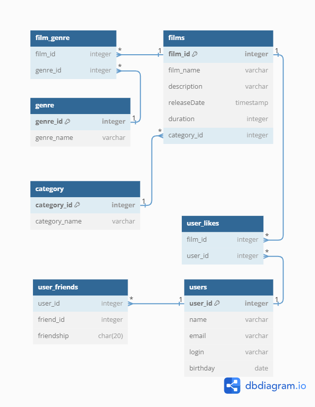

# java-filmorate

## ER-диаграмма

## Примеры запросов
### Получение N наиболее популярных фильмов

```
SELECT "film_name", count("user_id") AS "count_likes" 
FROM "films" AS "f"
JOIN "user_likes" AS "ul" ON "f"."film_id" = "ul"."film_id" 
GROUP BY ("film_name")
ORDER BY "count_likes" DESC;
```


